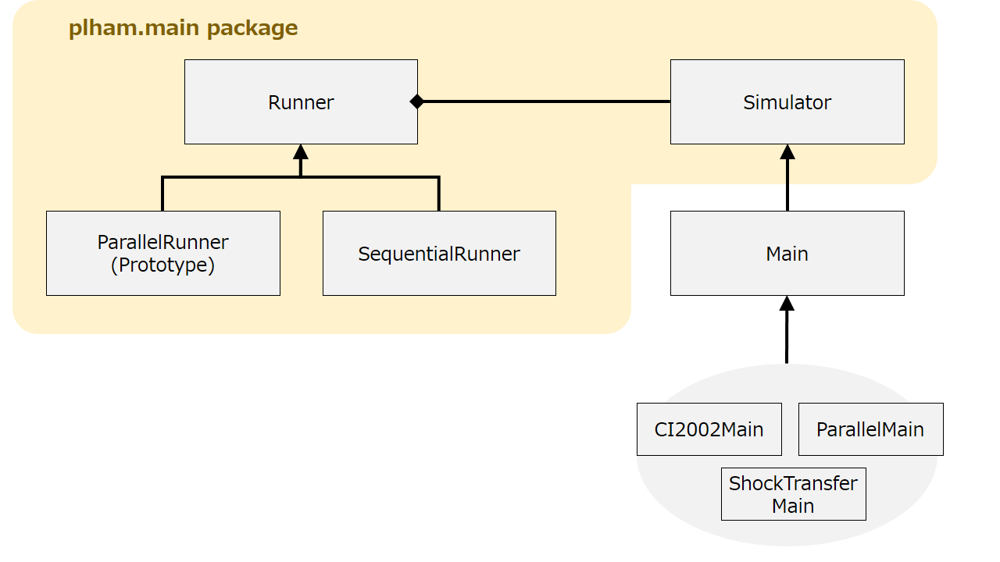

# Runner & Simulator

本記事ではシミュレーションに関する処理の基本的な流れ（処理単位の組み合わせ方）を解説する．
本ソフトウェア Plham では，人工市場モデル（simulation model）と計算実行モデル（execution model）を区別するが（考え方については[こちら](/Platform)），この流れ（処理単位の組み合わせ方）を定義するのが計算実行モデルである．
本記事では，人工市場モデルと計算実行モデルの相互作用についても解説する．


## Basic flow of artificial market simulations

シミュレーションに関する処理の基本的な流れを解説する．
この際，本稿では逐次的な計算実行モデルに基づいて記述する．
実際，下記で示すフローチャートは逐次実行モデルのものであり，並列実行モデルでは必ずしも上から順番に実行されるわけではない．
しかしながら，並列版においても実際に行われる処理単位は類似している．

以下は，逐次実行モデルを使用した場合のフローチャートを示す．

> 
  + 乱数シードの設定: <br>
    `new Random(seed)`
  + JSON ファイル読み込み: <br>
    `JSON.parse(configFile)`
  + ファンダメンタルの初期化: <br>
    `Main#createFundamentals()`
  + マーケットの初期化: <br>
    `Main#createAllMarkets()` → `Main#createMarkets()`
  + エージェントの初期化: <br>
    `Main#createAllAgents()` → `Main#createAgents()`
  + イベントの初期化: <br>
    `Main#createAllEvents()` → `Main#createEvents()`
    <br><br>
  + `Main#beginSimulation()`
  + 各セッション `s` ごとに，
    + `Main#beginSession()`
    + 各ステップ `t` ごとに，
      + イベントの状態を更新する（最初）
      + エージェントが注文を提出する: <br>
        `Agent#submitOrders()`
      + マーケットが注文を処理する: <br>
        `Market#handleOrders()`
      + マーケットの価格・状態を更新する
      + データを出力する: <br>
        `Main#print()`
      + イベントの状態を更新する（最後）
      + 次のステップに移る: <br>
        `t = t + 1`
    + `Main#endSession()`
  + `Main#endSimulation()`

ユーザが自らのシミュレーションを開発するうえで記憶しておくべきは，

  * `Main#createMarkets()`
  * `Main#createAgents()`
  * `Main#createEvents()`
  * `Main#print()`

といったメソッドであろう．

これらのメソッドは上記の順番で呼び出されるため，先に呼びだされ生成されたインスタンスについては後のメソッドからアクセスできる．
たとえば，`Main#createMarkets()` は `Main#createAgents()` より先に呼び出されるので，`Main#createAgents()` 内部ではマーケットのインスタンスにアクセスできる（逆はできない）．
各メソッドのオーバーライドの方法についてはチュートリアルで解説している．

上に示されるように `Main` で定義された（接頭辞 `Main#`）さまざまなメソッドが呼び出されている．
計算実行モデルによるが，並列実行モデルではこれらの実行内容がすべて並列的に行われる場合もある．
とくに，エージェントの意思決定 `submitOrders()` とマーケットの注文処理 `handleOrders()` は並列実行時の要となる部分なので，[別の記事](/Platform)で述べた「情報遅延」を伴う可能性が高い．

**補足**
イベントとは金融ショックや金融規制など，何らかの条件を引き金として発動する事象をさす．
現状の実装では，イベントには２種類用意されている：
(a) 各ステップごとに確認されるもの； (b) 各注文ごとに確認されるもの．
前者 (a) は価格暴落などを対応づけできるが，他方，後者 (b) には値幅制限などの規制を対応づけできる．
チュートリアルのテーマから想定される必要性から，現状の実装では (a) はステップの最初と最後に，(b) は注文処理の直前と直後に呼び出される．
上記のフローチャートには (a) のみ示した．


## Combination of Runner & Simulator

以下のコードは典型的な `main()` メソッドの記述である．
人工市場モデルと計算実行モデルがどのように組み合わせられるかを示している．

```x10
public class CI2002Main extends Main {

	public static def main(args:Rail[String]) {
		new SequentialRunner(new CI2002Main()).run(args);
	}
}
```

上記のコードでは，`CI2002Main` が人工市場モデルに対応し，`SequentialRunner` が計算実行モデルに対応する．
人工市場モデルは `plham.Main` を継承し，ユーザが構築したいシミュレーションに必要な部品を生成（インスタンス化，初期設定）する役割を担う．
他方，計算実行モデルは与えられた人工市場モデルをある特定の仕方で実行する役割を担う．

実装上では，`plham.Main` は `plham.main.Simulator` のサブクラスで，追加要素は一切ない．
また，`SequentialRunner` は `plham.main.Runner` のサブクラスで，通常の単一 CPU を用いた，逐次的な実行を担う．
現状では，他にも，プロトタイプ版 `plham.main.ParallelRunner` が用意されており，これは複数の計算ノードを跨いだ並列的な実行を担う．
以下に UML を示す．



現状では，`SequentialRunner` および `ParallelRunner` という「逐次」「並列」を直接的に反映した名前の `Runner` のみだが，`Runner` の役割は後述するシミュレーションの処理単位を組み合わせることであるため，更なる細分化が可能である．
さまざまな `Runner` が今後追加される予定である．
各 `Runner` の振る舞いについては個別の記事を参照してほしい．

