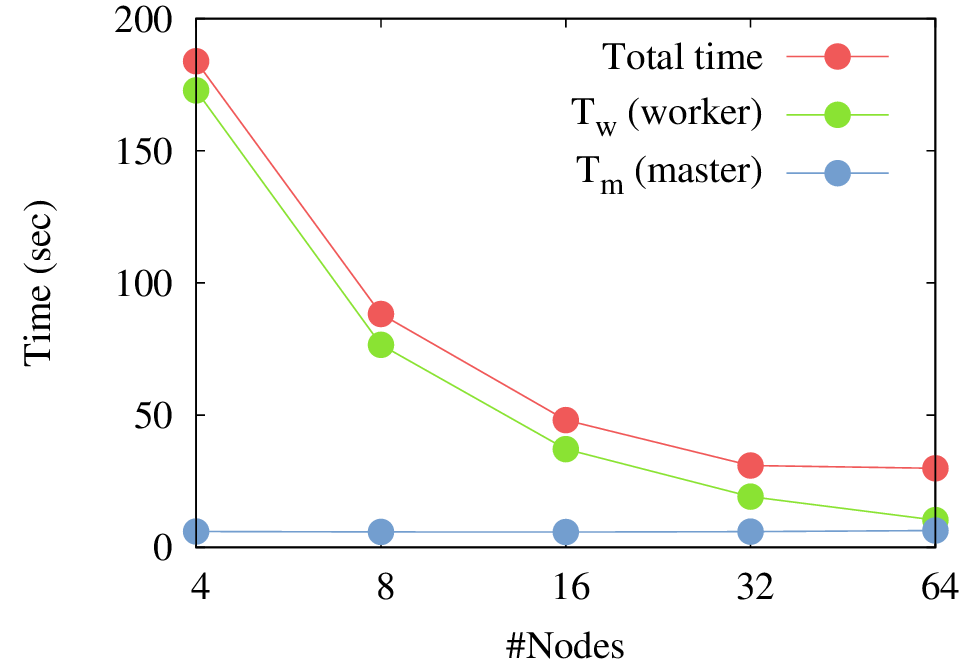

# ParallelMain

本記事ではプロトタイプ版並列実行モデル `ParallelRunner` を使い，ショック伝搬のシミュレーションを数十，数百銘柄規模で実行する方法を説明する．

本記事で扱う内容：

  * 並列実行モデル

関連するファイル：

  * `samples/Parallel/ParallelMain.x10`
  * `samples/Parallel/WorkloadFCNAgent.x10`
  * `plham/main/ParallelRunner.x10`


## WorkloadFCNAgent

並列計算が性能を発揮する状況として，最初に思いつくのは，各エージェントの意思決定が非常に高い計算負荷をもつ場合であろう．
例としては，ポートフォリオ最適化やモンテカルロ推定を行うエージェントが考えられる．
そこで本記事では，`FCNAgent` の拡張として意思決定時にモンテカルロ計算を行うエージェント `WorkloadFCNAgent` を用意する．
このエージェントは Black-Scholes モデルから時系列を標本抽出し（モンテカルロ推定に相当する計算を行い），__それを一切使わず__，本来の `FCNAgent` の意思決定方式に従い注文をだす．

実際に測定すればわかるが，`FCNAgent` は非常に軽量で，`FCNAgent` のみのモデルを並列実行すると，かえって実行時間がかかる．
並列実行には，同期や通信といった，逐次実行時にはない，さまざまな調整が必要だからである．


## Compile and run

本記事では MPI を用いた並列実行を行う．
バイナリ配布の X10 は MPI をサポートしていないので，X10 をコンパイルする必要がある．
詳しくは[公式サイト](http://x10-lang.org/articles/167.html)を参照してほしい．

実行時にはいくつかの環境変数を設定する必要があるので，`samples/Parallel/run.sh` を用意した．

```
$ x10c++ -x10rt mpi samples/Parallel/ParallelMain.x10
$ bash samples/Parallel/run.sh ./a.out samples/Parallel/config-002.json
```

`run.sh` の内容を以下に示す．
X10 の実行に必要な環境変数，および，`WorkloadFCNAgent` のパラメータを決める環境変数が宣言されている．

```
#!/bin/bash
X10_NPLACES=3
X10_NTHREADS=
X10RT_MPI_THREAD_SERIALIZED=true

BS_WORKLOAD=true
BS_NSAMPLES=10
BS_NSTEPS=10
ORDER_RATE=0.1

mpirun -np $X10_NPLACES $@
```

上記の `run.sh` では計算ホストは１台のみ用いるが，複数ホストの場合はホストを `mpirun` に指定すればよい．
詳しくは MPI のドキュメントを参照してほしい．

また，`config-002.json` は現物 2 個 + 指数 1 個のシミュレーションを実行する設定ファイルである．
他にも，`config-009.json` は現物 9 個 + 指数 1 個，`config-099.json` は現物 99 個のシミュレーションを実行する．
設定ファイルの生成方法は `samples/Parallel/config.json.sh` を用意したので，参考にしてほしい．


## ParallelMain

`ParallelMain` に関して特筆すべき点は少ないが，並列実行モデル `ParallelRunner` を使用している点が異なる．
`ShockTransferMain` などの逐次実行モデルと比較すれば，人工市場モデルに関する記述を一切変更することなく，計算実行モデルを置き換えることで，逐次実行から並列実行へ切り換えできていることがわかるだろう．

```x10
public class ParallelMain extends ShockTransferMain {

	public static def main(args:Rail[String]) {
		new ParallelRunner[ParallelMain](() => new ParallelMain()).run(args);
	}

	public def createAgents(json:JSON.Value):List[Agent] {}

	public def createEvents(json:JSON.Value):List[Event] {}
}
```


## Simulations

以下の図は Torii etal (2016) で報告したプロトタイプ版並列実行モデルの「京コンピュータ」上での計測結果である．
論文の実験では理想的な状況を用意しているが，合計計算時間が指数的に減少している（ノード数が 2 倍になると時間が 1/2 倍になる）ことがわかる．




## Related works

  * Torii, Kamada, Izumi, Yamada (2016) Platform Design for Large-Scale Artificial Market Simulation and Preliminary Evaluation on the K computer.

